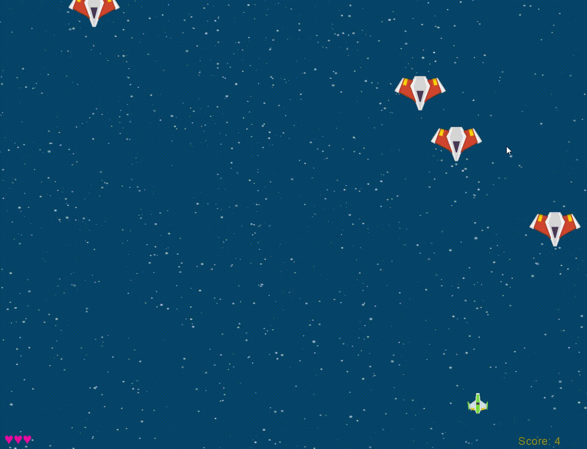

# SpaceShip Game [Complete] 🚀

Welcome to the **SpaceShip Game**! Your mission is to **protect your planet** from incoming enemy ships. Destroy as many enemy ships as possible to increase your score. But be cautious—running out of lives means **game over**!

## How to Play

1. **Controls**:
   - **Left Arrow Key (or A Key)**: Move the spaceship to the left.
   - **Right Arrow Key (or D Key)**: Move the spaceship to the right.
   - **Spacebar**: Shoot lasers to **obliterate enemy ships**.

2. **Objective**:
   - **Defend your planet** by eliminating enemy ships.
   - Accumulate points by **annihilating as many enemy ships as you can**.

3. **Game Over**:
   - The game concludes when you exhaust all your lives.
   - Your final score will be displayed.
   - You can restart the game to **embark on another cosmic battle**.

Prepare for interstellar combat and safeguard your planet! 🚀✨
## GamePlay



## Installation

Make sure you have the **Arcade library** installed. If not, you can install it using :

```bash
pip install arcade
```

## Usage
1. clone repo.
2. run python code :
```bash
python3 spaceship.py
```
