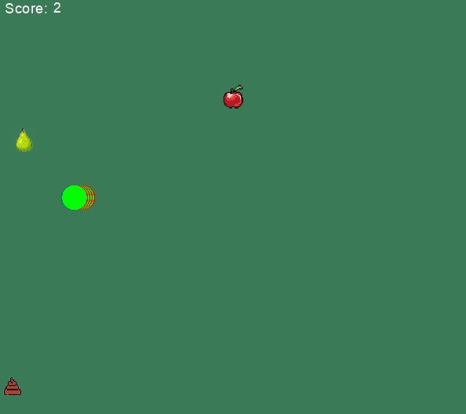

# Super Snake Game 🐍

Embark on a nostalgic journey with the **Super Snake Game**, where strategy meets fun! Guide a ravenous snake through a pixelated world, gobbling up fruits and dodging obstacles to rack up a high score.

## Features 🌟

- **Retro Aesthetics**: Enjoy the classic 8-bit graphics that evoke the golden era of arcade games.
- **Infinite Gameplay**: No two games are the same! Challenge yourself with endless possibilities.
- **Score Tracker**: Compete against yourself or friends with a local high score leaderboard.

## 🎮 Controls

Navigate your snake with ease using the arrow keys:

- **↑ UP**: Propel the snake northward.
- **↓ DOWN**: Send the snake southward.
- **→ RIGHT**: Steer the snake eastward.
- **← LEFT**: Direct the snake westward.

## 📜 Game Rules

- **Fruit Feast**: Snatch apples and pears to swell your score.
- **Obstacle Ouster**: Evade the perilous poo! A collision spells the end.
- **Boundary Bravery**: Venture not beyond the edge, lest you wish to restart.

Get ready to guide your snake to victory! 🐍🍎🍐

## Gameplay 🎲

Engage in an enthralling game of chase and growth as your snake seeks out its next meal. Each fruit consumed lengthens your snake and ups the ante. How long can you last?

## 🚀 Quick Start

Unleash the fun with these simple steps:

1. Clone the repository: `git clone https://github.com/your-username/supersnake.git`
2. Navigate to the game directory: `cd supersnake`
3. Launch the game: `python supersnake.py`
4. For an AI play through, run: `python supersnake_ai.py`

