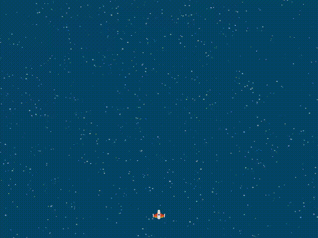

---

# Spaceship Game 🚀🌍

This Python program is a simple space game featuring a user-controlled spaceship and enemies moving towards the user.

## Installation

Make sure you have the **Arcade library** installed. If not, you can install it using :

```bash
pip install arcade
```

## Gameplay




## Usage

1. Run the program.
2. Use the left and right arrow keys to maneuver the spaceship.
3. Avoid colliding with enemies.


---

# Diamond Grid ♦️ 

This Python program displays a grid of colored diamonds in a window.

## Usage

The program generates a grid of colored diamonds where every other row and column alternates between red and blue colors.


---
### References

 [Triangle arcade](https://api.arcade.academy/en/latest/examples/nested_loops_bottom_left_triangle.html#nested-loops-bottom-left-triangle)

