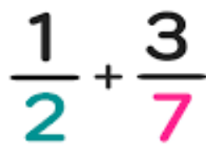

# Object-Oriented Programming Projects README

This README outlines a series of programming projects designed to practice and implement Object-Oriented Programming (OOP) concepts in Python. Each project focuses on creating classes for different mathematical and real-world concepts.

## Table of Contents

- 11.1: Fraction Class Project
- 11.2: Time Class Project
- 11.3: Complex Number Class Project
- 11.4: Carpet Pattern Function Project

## 11.1: Fraction Class Project

Complete a class for fractions with the following functionalities:

### Operations
- **Addition**: Implement a method to add two fractions.
- **Multiplication**: Implement a method to multiply two fractions.
- **Subtraction**: Implement a method to subtract one fraction from another.
- **Division**: Implement a method to divide one fraction by another.
- **To Decimal**: Implement a method to convert a fraction to a decimal number.
- **Simplify**: Implement a method to simplify a fraction to its lowest terms.

## 11.2: Time Class Project

Create a class for time calculations with the following functionalities:

### Operations
- **Addition**: Implement a method to add two time objects. Adjust minutes and seconds if they exceed 60.
- **Subtraction**: Implement a method to subtract one time object from another. Adjust minutes and seconds if they fall below zero.
- **To Seconds**: Implement a method to convert time to total seconds.
- **From Seconds**: Implement a method to set time based on a total number of seconds.
- **GMT to Tehran Time**: Implement a method to convert GMT time to Tehran time.

## 11.3: Complex Number Class Project

Develop a class for complex number calculations with the following functionalities:

### Operations
- **Addition**: Implement a method to add two complex numbers.
- **Multiplication**: Implement a method to multiply two complex numbers.
- **Subtraction**: Implement a method to subtract one complex number from another.

## 11.4: Carpet Pattern Function Project

Write a function that:

- Accepts an integer `n` as a parameter.
- If `n` is odd, generates and returns a carpet pattern with dimensions `n*n`.
- If `n` is even, returns an appropriate message.
- For a more visually appealing output, consider using emojis instead of numbers.

## Additional Information

- No need to implement the internal logic of methods.
- Discuss the properties and methods that these classes could have in the group.
- For more details on the carpet pattern function, visit Edabit Challenge.

Feel free to use these project outlines to enhance your understanding of OOP in Python and to create functional classes for various applications.

## Contributing

Feel free to contribute questions or solutions by submitting a pull request. Make sure to follow our contribution guidelines.

## Support

If you have any questions or need help, please open an issue, and we'll assist you.

Happy Learning!